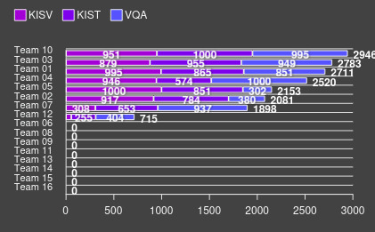
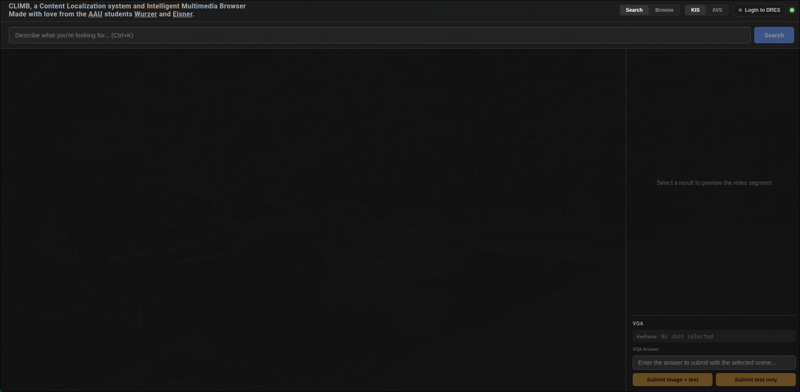
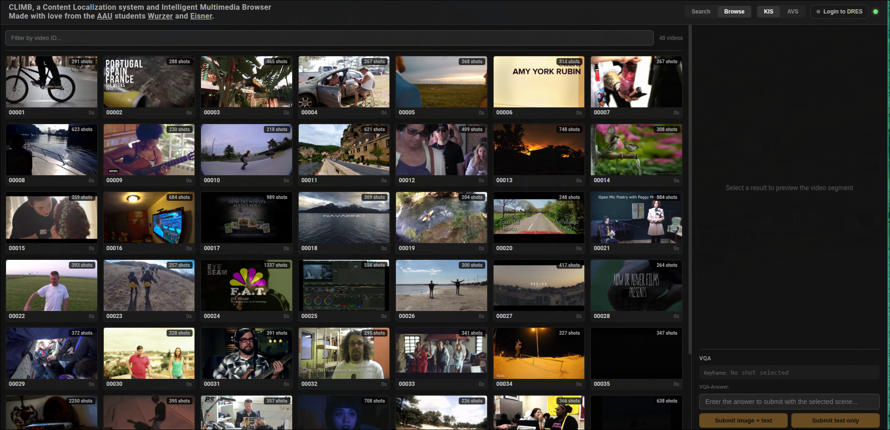
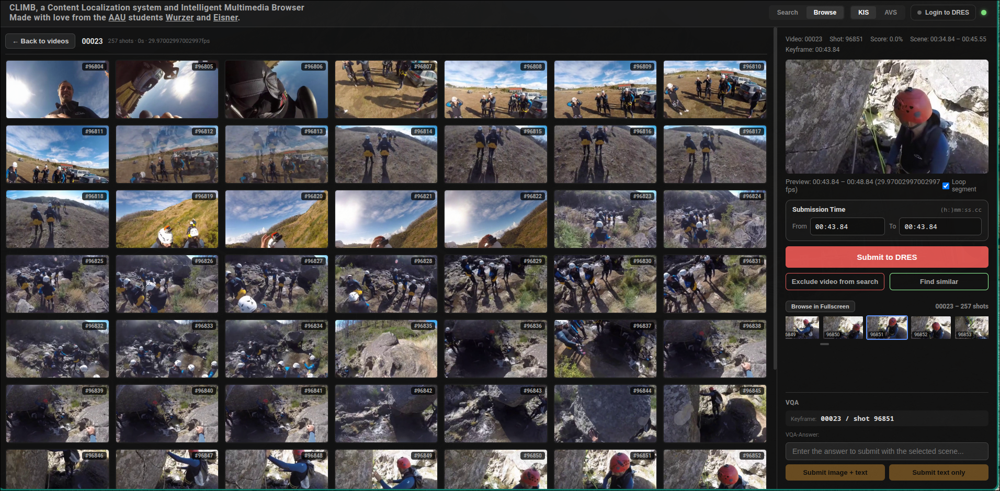
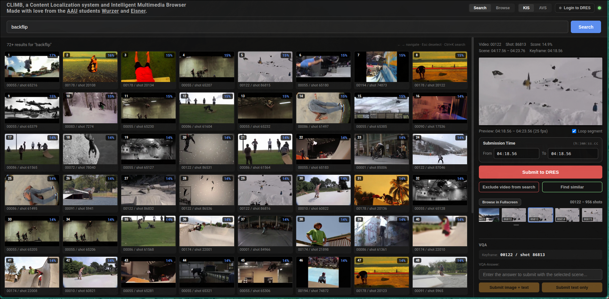
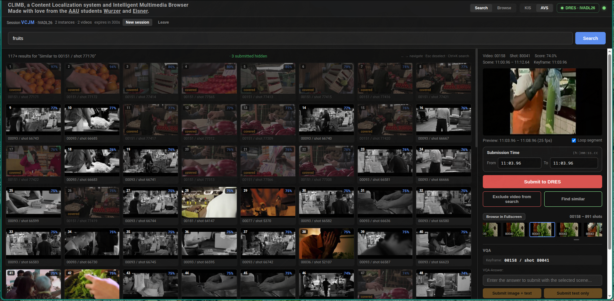

# CLIMB

A contest winning Content Localization system and Intelligent Multimedia Browser.



<i>Figure 1: Competition scores. We are Group 10.</i>

---

A content-based video retrieval system designed for searching short video segments, focusing on Known-Item Search (KIS)
and Visual Question Answering (VQA) tasks, as well as Ad-Hoc Video search (AVS), inspired by the Video Browser Showdown (VBS).
The system provides an intuitive graphical user interface for interactive video exploration and integrates with the
Distributed Retrieval Evaluation Server (DRES) through its REST API, enabling seamless submission of retrieved video
segments.

## Getting Started - User

### Run CLIMB for the first time

In order to run CLIMB, you will need to make sure that the following things are fulfilled:

- You will need the processed media in `dataset/media/` , the 360p videos under `media/video/`, the keyframes under
  `media/kf/` and `media/thumbs/`. Set `CLIMB_MEDIA_DIR` if you keep them on an external drive instead
- (To see how to produce all of that, see the "Decoding" section under "Getting Started - Developer")
- Make sure the database exists and the migrations are applied. There is no dump to restore any more , the old
  `dataset/climb_db.dump` was from the pre-pg17 schema and would not load even if you still had it (see the word of
  warning under "The Database"). `python main.py schema` prints the podman command, `python main.py migrate` does the
  rest, and then you embed, (Which means yes, given you don't have a new dump, you will need to embed everything 
  yourself, for that follow the "Getting Started - Developer" Section)
- Verify that there is a `.env` file in the root directory having all the necessary Parameters (listed in Section "
  Environment Variables")

If all that is done, you can run `setup_climb.sh` (found in the root directory)

```bash:
./setup_climb.sh
```

Once you are set up, simply run `start_climb.sh` (also found in the root directory)

```bash:
./start_climb.sh
```

### Restart CLIMB

If you already setup climb you can always restart it using the shell scripts

```bash:
./start_climb.sh
```

If we don't support your terminal emulator, and you don't want to have all processes running in the same one, you can

```bash:
./start_climb_using_conda.sh
```

but for that you will need to use conda, otherwise you are fine with plain python.

To setup the exact same conda environment used in this shell script, move to the video_processing folder and run
```bash:
conda env create -n climb -f conda_environment.yml
```

## How To use CLIMB

Using CLIMB is as simple as climbing a ladder ;)

When opening up the climb website, you will see a pretty empty screen. Don't be scared it's all how it's supposed to be:



At the very right end of the header, past the "Login to DRES" button, there is a small circle telling you whether CLIMB's
own services are up. The frontend re-checks every 5 seconds and the colour means:

- green: backend and embedding service both answer, everything works
- green with a yellow blink: everything works **except** AVS collaboration - the shared session service cannot be
  reached, so your teammates' submissions stop showing up. Searching, browsing and submitting to DRES are completely
  unaffected, which is why this is not orange. A blinking green light means "carry on, but you are on your own"
- orange: the backend is up but the embedding service is not, so browsing, playback and submitting still work while text
  search does not. Usually you forgot to start the search engine (`python main.py serve`) or it could not
  reach the database
- red: the backend cannot be reached at all, nothing will work until it is back

Hovering the circle tells you which piece is missing and why.

If you are in a competition I can recommend 2 things:

- sabotage your opponents
- connect to DRES in order to be able to submit frames to the server.
  In order to connect to dres, click the "Login to DRES" button in the top right of the header. A popup opens where you
  fill in the server URL, the evaluation name (e.g. IVADL26), your username and your password. Enter submits the form,
  Esc or a click outside closes it, and the popup closes by itself once you are connected.

Once connected the popup shows which evaluation you actually landed on, with its name on top and its id underneath. That
matters because DRES falls back to the first available evaluation if the name you asked for does not exist, so the name
alone does not tell you where your submissions are going. The header button is your status light: a grey dot and "Login
to DRES" while disconnected, a green dot and "DRES · &lt;evaluation name&gt;" once you are in. Click it again any time to
reopen the popup and reconnect.

If you don't want to search for something specific, but want to just browse through all the videos select the browsing
tab on the top right.
We will dynamically load more videos on scrolling and cache the Videos loaded for faster retrieval.

Scrolling through search results is cheap now. The first page runs the actual search and everything after it is
served from cache, so page four arrives in about 15ms instead of running a fourth search and throwing three pages of
it away.

Results are **one row per keyframe**. This used to be one row per scene, on the theory that seven near-identical
frames of the same shot were a waste of a page. Turns out that was throwing away the most useful thing on the screen:
if the ten best keyframes are all the same shot, that shot is almost certainly the answer, and collapsing them to a
single row hides exactly that. In an AVS session a submitted scene drops out of the results anyway, so the repetition
costs you a page slot precisely once.



If you click on a video you can see **all of its keyframes**, not one per scene. For a 58-minute video with 33 master
shots that is 611 tiles instead of 33 , the badge on each tile is still the shot number, so the scene structure stays
readable while you scroll, and the timecode underneath tells two frames of the same shot apart. Showing one tile per
scene was hiding 95% of what the pipeline had already decoded, embedded and OCR'd, which is a lot of GPU
time to spend on frames nobody could look at. Click one and it opens in the right bar.



The film tape at the bottom of the panel is **every keyframe of the whole video** in order.
Next to it is a large submit to DRES button if you want to submit the current scene.
Additionally there is an "VQA-Answer" field where you can enter a textual answer for a Visual Question Answering Task. 
Two submit buttons let you choose what goes to DRES: "Submit image + text" sends your answer together with the selected scene, 
"Submit text only" sends just the answer for tasks where DRES expects no media item. Both ask for confirmation first, double-clicking a button confirms it.

Every submission shows a result box with the DRES status code, a plain language summary and the verdict, 
e.g. 200 · Accepted & graded · CORRECT. Green means a correct verdict, red a wrong or rejected one, and amber 
(202 · Accepted - awaiting verdict) means DRES took the submission but hasn't judged it yet.

For Ad-hoc Video Search (AVS) tasks, switch the KIS/AVS toggle in the top bar (next to Search/Browse) to AVS. 
AVS is collaborative: click New session to get a random 4-letter code, or Join a teammate's code to work together. 
Each shot you submit is sent as its own submission and is then hidden from everyone in the session's search results, 
so no one on the team submits the same scene twice. Videos where you already got a correct hit are dimmed and marked 
"covered", since extra shots from the same video barely raise the AVS score. Sessions are deleted after 2 hours of
inactivity, which is meant to comfortably outlive a task block rather than punish you for thinking.

Sessions are shared through a small separate service (see [2.6](#26-avs-collaboration-across-machines)), so
collaboration works even when everyone runs their own CLIMB on their own laptop - which at a competition you very much
want to, because that keeps thumbnails and video on localhost instead of on the venue wifi. If that service ever
becomes unreachable you get a "collab offline" badge next to the session code and the header light starts blinking
yellow: you keep the session and every scene already known to be taken, you just stop hearing about new ones until it
is back. Nothing about searching or submitting changes. If instead the session genuinely expired you get a
"Session XXXX expired" banner - a different message on purpose, because one of them means "wait a moment" and the other
means "start a new session".

Going back to the search tab, you can search for video scenes including specific content.



Under the "submit to DRES" button, you can find a "find similar" button which will instead of asking the backend for
scenes including your queries will search for scenes similar to the one you clicked earlier.



Well and that's it.

## Environment Variables

In order for CLIMB to work correctly you will need to create a `.env` file in the root directory.

And example file is provided here (please change the password):

```text:
POSTGRES_DB_NAME=CLIMB_DB
POSTGRES_PASSWORD=password
SEARCH_ENGINE_URL=localhost
SEARCH_ENGINE_PORT=5000
REDIS_URL=redis://localhost:6379
VIDEOS_CACHE_TTL_SECONDS=30
DB_PORT=5432
DB_HOST=localhost
BACKEND_URL=localhost
BACKEND_PORT=8000
FRONTEND_PORT=3000
ALLOWED_ORIGIN_REGEX=^https?:\/\/(?:[a-zA-Z0-9-]+\.)*q1studios\.at(?::\d+)?$
```
If you want AVS collaboration across machines you need three more. Leave them out and AVS still works, it is just private to your own CLIMB:

```text:
AVS_SESSION_SERVICE_URL=https://example.org
AVS_SESSION_TOKEN=supersecrettoken
CLIMB_USER=AlexHonold
```

That is the service wiring, and it is deliberately not the full list. The pipeline reads about thirty more
`CLIMB_*` knobs, media and work directories, decode workers, batch sizes per model, OCR backend, caption model,
the four RRF weights, the temporal query defaults. **`config.py` is the reference for those**; this file documents
the ones you need to get started rather than pretending to be complete.

---

## Getting Started - Developer

### Project Structure

```text
.env                        # Environment variables and secrets
start_climb.sh                # Launch ClIMB
setup_climb.sh                # Setup CLIMB
start_climb_using_conda.sh    # Launch CLIMB using Conda
backend/
    openapi.yaml            # API specification
    package.json            # Backend dependencies
    server.js               # Express API server
    mock-dres-server.js     # a fake DRES to test submissions against (port 8080)
    avsSessionClient.js     # talks to the AVS session service, and mirrors it so search never waits
    serviceUrls.js          # resolves the backend / search engine / avs service base urls from env
    controller/             # Route handlers
    models/                 # Database models and queries
    routes/                 # Express routes

climb-avs-service/          # the shared AVS session bookkeeper, deployed once for the whole team
    server.js               # 5 routes wired to the controller. That is the entire service
    sessions.controller.js  # what those 5 routes actually do
    auth.js                 # bearer token + rate limit, the whole door
    sessionStore.js         # the sessions themselves, in memory; the backend requires this too for solo mode
    Containerfile           # one dependency, no DB, no dataset, no media, no DRES credentials
    package.json

dataset/                    # local folder only
    V3C1_200/               # Source video dataset
    media/                  # everything we keep (point CLIMB_MEDIA_DIR at your SSD instead)
        video/              # 360p web-playable copies
        kf/                 # 384px keyframes
        thumbs/             # 160px keyframes for the result grid
    work/                   # everything we throw away again (CLIMB_WORK_DIR)
        raw/                # downloaded source videos
        cand/               # candidate frames, before selection picks from them
        audio/              # extracted audio, waiting for Whisper

frontend/
    index.html              # Application shell
    package.json            # Frontend dependencies
    vite.config.js          # Vite dev server config
    public/                 # Static assets
    src/
        App.jsx             # Main application component
        App.css             # Styles
        main.jsx            # React entry point
        dresSubmission.js   # formatting of DRES submission results
        timecode.js         # timecode <-> ms <-> frame conversion
        sceneKey.js         # one canonical scene identity for grid, browser and AVS
        components/
            SearchBar.jsx   # Search input with history
            ResultsGrid.jsx # Thumbnail grid of results
            VideoPlayer.jsx # Video player with segment loop
            ShotBrowser.jsx # Filmstrip of every keyframe in the video
            KeyframeTime.jsx # editable keyframe time fields
            VideoBrowser.jsx# Browse all videos
            VqaAnswer.jsx   # VQA answer input + DRES submit buttons
            SubmissionLog.jsx # Submission history log
            AvsSessionBar.jsx # AVS session create/join controls
            DresLoginModal.jsx # DRES login popup
            BackendStatusDot.jsx # backend liveness circle in the header

video_processing/
    requirements.txt           # python dependencies        
    pytest.ini                 # test config; `-m "not integration"` is the fast run
    tests/                     # 157 tests: pure logic + HTTP integration + DRES/AVS
    migrations/                # numbered .sql schema migrations, applied in order
        001_core_schema.sql    # videos / scenes / keyframes / text tables / ingest_jobs
        002_vector_function_costs.sql # teaches the query planner that vector math isn't free
        003_videos_damaged_flag.sql   # marks videos whose bitstream only partly decodes
        004_model_aware_embeddings.sql # lets more than one embedding model coexist
        005_text_embeddings.sql        # transcript vectors
        006_caption_embeddings.sql     # caption vectors
    src/
        config.py              # Settings
        custom_logger.py       # Logging utilities
        db_setup.py            # Prints the podman command, nothing more
        main.py                # CLI entry point (subcommands)
        utils.py               # Utility functions
        worker_http_endpoint.py # Search Engine HTTP interface
        retrieval/
            query_parser.py    # search box string -> structured query
            retrievers.py      # the four signals, all scene-level
            temporal.py        # `A >> B` chains: linking stages across time
            fusion.py          # reciprocal rank fusion
            engine.py          # ties them together
        db/
            connection.py      # DB connections + a commit/rollback context manager
            migrate.py         # migration runner (with checksums, so nobody edits history)
            index_ops.py       # builds/drops the expensive ANN + GIN indexes
        pipeline/
            runner.py          # enqueue / fetch / purge / status -- the batch lifecycle
            probe.py           # ffprobe metadata (fps, duration, dimensions, audio)
            device.py          # picks cuda / mps / cpu
            embed.py           # SigLIP2 vectors
            ocr.py             # on-screen text
            caption.py         # VLM shot descriptions
            asr.py             # Whisper transcripts
            text_embed.py      # transcript + caption embeddings
            shot_boundaries.py # parses master shot boundary files -> scenes
            decode.py          # the one-pass FFmpeg stage
            keyframe_selection.py # thins candidate frames down to 2-32 per shot
            paths.py           # where everything lives on disk, derived not stored
    logs/                     # Log files (local only)
   
readme_images/              # Images displayed in readme
```

### 1. Video Processing

In order to get started you will first need to process the videos. Extract the keyframes, encode them and compress them
down to decrease loading time in the frontend.
To do that go into the video processing part of CLIMB by running

```bash
cd video_processing
```

#### 1.1 Installation

Run

```bash
pip install -r requirements.txt
```

to install neccessary requirements.

Two things that are easy to lose an evening to:

- **`torchvision` is not optional.** Captioning needs it, and without it both VLMs fail with
  `Unrecognized image processor`, which sends you hunting through the model repo instead of the venv. It is pinned to
  `0.27.1` because that is the version that matches `torch==2.12.1`; a bare `pip install torchvision` will happily
  upgrade torch to 2.13.0 behind your back.
- **PaddleOCR needs Python ≤ 3.13.** There is no `paddlepaddle` wheel for 3.14 at all, so on a 3.14 venv OCR falls
  back to `rapidocr-onnxruntime` automatically. `CLIMB_OCR_BACKEND` forces the issue either way
  (`auto` / `paddle` / `rapidocr`); the interface is the same.

In case you prefer using a conda environment run
```bash:
conda env create -n climb -f conda_environment.yml
```

All steps can be done by running ```main.py``` with the respective options. In order to have the correct relative paths
please run

```bash:
cd src
```

to step into the src folder.

#### Available commands

CLIMB's pipeline is driven by subcommands:

```bash
python main.py <command> [options]
```

| Command        | What it does                                                                    |
|----------------|---------------------------------------------------------------------------------|
| `schema`       | Print the podman command for the database                                       |
| `migrate`      | Apply pending schema migrations. Run this first, always                         |
| `enqueue`      | Load a manifest of videos into the job queue                                    |
| `fetch`        | Download queued videos                                                          |
| `ingest-shots` | Probe the videos and load one scene per master shot                             |
| `decode`       | One FFmpeg pass: 360p copy + candidate frames + audio                           |
| `select`       | Pick 2-32 keyframes per shot and write the images                               |
| `purge`        | Delete transient files whose stage has finished                                 |
| `embed`        | SigLIP2 vectors (GPU)                                                           |
| `ocr`          | Read on-screen text (GPU)                                                       |
| `caption`      | Describe each shot (GPU)                                                        |
| `asr`          | Transcribe the audio with Whisper (GPU)                                         |
| `embed-text`   | Encode transcripts and captions for meaning-based search (GPU)                  |
| `index`        | `build`, `drop` or `status` for the search indexes                              |
| `run`          | Several stages in one go, always in pipeline order                              |
| `status`       | What is done and what is left                                                   |
| `serve`        | Start the search engine the backend talks to                                    |

Every command takes `--collection` and `--limit`. The GPU ones also take `--shard N --shards M`.
`python main.py <command> --help` explains any of them.

The whole batch in one line:

```bash
python main.py run
```

which is `fetch,ingest-shots,decode,select,purge` , pick your own with `--stages`. Order does not matter,
they get sorted into pipeline order regardless, so you cannot accidentally ask it to select keyframes from a
video it has not decoded yet.

Everything is resumable. Every stage works out what is still outstanding by asking the database, so a run that
dies halfway can simply be run again, and a run with nothing left to do takes about five seconds.

```bash:
python main.py --help
```

#### 1.2 Data Preprocessing

Download and extract your Dataset (i.e. from: "https://www2.itec.aau.at/owncloud/index.php/s/AcA1pvZIpDrOom5").
Save it to ```/dataset/V3C1_200``` also extract the scenes and put them under ```/dataset/V3C1_200/scenes_v3c1_200```.
If you would like to choose a different Dataset / Folder structure edit the respective parameters in
```/video_processing/src/config.py```

Please be sure that you have FFmpeg installed under your system as CLIMB will spawn a whole lot of child-processes
executing FFmpeg. To download FFmpeg visit: https://ffmpeg.org/download.html

Video compression used to live here as its own step. It has moved into the decode stage (section 1.5), which does the
compressing, the frame extracting and the audio ripping in a single pass, because decoding the same video three times
was a bit silly.

#### 1.2.1 The job queue

At full V3C scale you cannot keep the videos. They live on the university server, come down a batch at a time,
get processed, and go away again. That loop is what `enqueue` / `fetch` / `purge` are for:

```bash 
python main.py enqueue --manifest videos.txt   # a list of source URIs, one per line
python main.py fetch                           # pulls the next batch down
...                                            # decode, select, and so on
python main.py purge                           # throws away what is no longer needed
```

How the videos are actually reachable is your business, not the pipeline's , set `CLIMB_FETCH_COMMAND` to
whatever works (`rsync -a --partial {source} {dest}` by default, but scp, curl or cp are all fine).

`purge` is careful rather than clever. It does not wait for the whole pipeline to finish before freeing
anything, because the working set is what your SSD is spent on:

- the **downloaded video** goes as soon as decode has produced the 360p copy and the candidate frames. It is by
  far the biggest thing and nothing afterwards reads it
- the **candidate frames** go once every scene in that video has a keyframe
- the **audio** goes once the video has been transcribed, or if it never had any

Each of those is checked against what is actually in the database and on disk, so a decode that died halfway
cannot talk purge into deleting the only copy of the source.

```bash 
python main.py status
```

tells you where everything stands: how many videos are at which stage, how many scenes, keyframes, embeddings,
captions and transcripts exist, and how much transient junk is still sitting on disk.

#### 1.3 The Database

Everything downstream needs a database: the frame rate of every video (so we can build the millisecond payload for the
DRES server), the master shots, the keyframes and eventually a couple of million embeddings.
Because every sane people hates it when postgres runs locally on your machine we will spin up a podman container for
that. The parameters
for the database can be found and edited in ```/video_processing/src/config.py```. Sensitive information should be  
stored in a ```.env``` file placed in the root directory of the project ```(CLIMB/)```.
To automatically generate the podman command run

```bash 
python main.py schema
```

In order to create a Podman Container running Postgres
just run the command in you shell. This will automatically fetch the postgres image, build the container and start it in
the background.
To stop the container just run

```bash 
podman stop climb
```

To restart the container run

```bash 
podman start climb
```

Always start the container before running any video_processing / frontend or backend otherwise CLIMB won't function
properly.

(Note: Other usefull commands include ```podman ps``` to see all running containers and ```podman logs climb``` to see
the logs if you stumble upon undesired behaviour. For more details however I will recommend their excellent
documentation found under https://docs.podman.io/en/latest/)

**A word of warning if you have been here before:** we moved from ```ankane/pgvector``` (Postgres 16, pgvector 0.5.1) to
```pgvector/pgvector:pg17``` (Postgres 17, pgvector 0.8.x), because 0.5.1 has neither ```halfvec``` nor binary
quantization and we need both to survive the full V3C dataset. Postgres does not do major version upgrades by politely
reading the old files, so an existing ```postgres_data``` volume and the old ```climb_db.dump``` are **not** reusable.
Use a fresh volume name and rebuild. Sorry.

##### 1.3.1 Create the schema

The tables live in ```/video_processing/migrations/``` as numbered ```.sql``` files, and get applied in order by

```bash 
python main.py migrate
```

This is safe to run as often as you like, it only applies what is missing. It also refuses to run if somebody edited a
migration that was already applied, because two machines quietly disagreeing about what the schema is, is a fun
afternoon nobody asked for. Need to change something? Add a new migration.

You no longer need to create the ```vector``` extension by hand, migration 001 does it for you (along with ```pg_trgm```
and ```unaccent```).

#### 1.4 Master shot boundaries

V3C ships with predefined *master shot boundaries*: the official list of where each shot starts and ends. That list is
the backbone of the whole index, so it goes in before anything else touches a video.

```bash 
python main.py ingest-shots
```

This walks the dataset, runs ```ffprobe``` on every video (frame rate, duration, dimensions, whether there is an audio
track at all) and writes one ```scenes``` row per master shot. Frame rates come from ffprobe rather than OpenCV, because
OpenCV cheerfully returns 0 or NaN for a decent number of V3C files and the old code's answer to that was "eh, must be 30
fps" , which then quietly poisons every timestamp we ever send to DRES for that video. The 200-video set alone has ten
different frame rates in it, including such beauties as 23.000689 and 29.97003.

The parser handles both the course's ```<video_id>.mp4.scenes.txt``` files and the official V3C boundary TSVs. It works
out which columns hold the frame numbers by looking at what is actually in them instead of trusting a fixed column
order, so it does not care whether NIST puts the frames before or after the timecodes, and it falls back to converting
timecodes with the probed frame rate if a file has no frame columns at all. One corrupt line gets skipped with a warning
rather than taking the whole video down with it.

#### 1.5 Decoding

Now the actual work. Run

```bash 
python main.py decode
```

and go do something else for a while. For each video this spawns exactly **one** FFmpeg process which decodes it once
and produces three things at the same time:

- a 360p H.264 copy under ```media/video/``` , this is what the frontend plays, and at full V3C scale it is the only
  copy of the video we keep once the original goes back to the server
- candidate frames under ```work/cand/``` , one every half second, which keyframe selection will later thin down
- a 16 kHz mono Opus track under ```work/audio/``` , food for Whisper

The old code did this in two passes: ```--compress``` decoded the whole video to transcode it, then
```--extractKeyframes``` decoded it *again*, seeking to each keyframe individually with OpenCV. Seeking to an arbitrary
frame in H.264 means decoding forward from the previous I-frame, so sampling once a second re-decodes most of the video
over and over , and when OpenCV's seek missed (which on V3C it does), the fallback rewound to the start of the shot and
walked forward frame by frame. On the 39-minute shot in video 00191 that is about 56,000 sequential reads to get one
picture. It worked. It just did not need to.

A few things worth knowing:

- **It will not upscale.** The web copy is capped at 360 lines, so the already-small 480x270 course videos are left at
  their own size instead of being blown up for no reason.
- **Candidate frames are JPEG, not WebP.** They get deleted the moment selection has run, so WebP's nicer compression
  buys nothing, and it is not free: 3.1s per video versus 0.1s. The keyframes we actually *keep* are WebP.
- **Tuning knobs**, all environment variables: ```CLIMB_DECODE_WORKERS``` (default 6), ```CLIMB_FFMPEG_THREADS```
  (default 2) and ```CLIMB_X264_PRESET``` (default ```veryfast```). Set ```CLIMB_MEDIA_DIR``` and ```CLIMB_WORK_DIR``` to
  put the output on your external SSD rather than filling up your laptop.
- **NVENC is used automatically if your GPU can actually do it.** Note the "actually": the old check just asked FFmpeg
  whether it knew what NVENC *was*, which every distro build cheerfully says yes to, GPU or no GPU. It now tries to
  encode a single tiny frame and believes the result. If a GPU encode fails mid-run (consumer cards limit how many
  NVENC sessions you can have at once) that video quietly falls back to the CPU.

- **Broken videos get indexed anyway.** V3C1_200 contains two videos (00016 and 00024) whose H.264 streams are damaged
  , the container promises 23,120 and 47,289 frames, the bitstream delivers about 84% of that and a great deal of
  shouting about NAL units. Throwing away five sixths of a video because the last sixth is rubbish would be a shame, so
  those get indexed from whatever decodes and flagged as ```damaged``` in the database, which is why their keyframe
  coverage looks thin later.
- **A short extraction that is *not* explained by a broken file fails the video instead.** That combination means
  something went wrong outside the video , a full disk, most likely , and is worth retrying. Ask me how I know.

#### 1.6 Keyframe selection

The decode step left a pile of candidate frames, two per second, which is far more than anyone needs. Thinning them down
is its own step:

```bash 
python main.py select
```

Each master shot gets **2 to 32 keyframes, picked for how different they look from each other** rather than by the
clock. The rule:

1. **How many.** `k = ceil(shot_seconds / 4)`, clamped to between 2 and 32. A 3-second shot gets 2, a two-minute one
   gets 32. The old pipeline took one frame per second no matter what, which is how a single 39-minute shot ended up
   with 2,329 keyframes that all look the same.
2. **Throw out the rubbish, but not the title cards.** Frames that are nearly black, nearly white, or nearly flat are
   dropped. A frame only counts as rubbish if it *also* has basically no edges in it, 
   because white-on-black credits score exactly like a fade on brightness alone, and those are
   some of the most useful frames we have (dense readable text is a gift for OCR and for text-based tasks). If *every*
   frame in a shot is genuinely blank, the least boring one is kept anyway, because a scene with no keyframe at all is
   worse.
3. **Describe each frame cheaply.** A colour histogram, a coarse structural hash and an edge-density number.
4. **Pick the spread.** Start from the most typical frame of the shot, then repeatedly add whichever remaining frame is
   least like everything picked so far. You end up covering the shot instead of collecting near-duplicates of its first
   second.
5. **Very short shots** (under half a second , about 5% of them, and no candidate frame happens to land inside) simply
   get their middle frame pulled straight out of the video.

Each chosen frame is written twice: 384px for the detail panel and as model input, 160px for the results grid. Both
WebP, roughly 12 KB and 6 KB. For the 200-video set that is **35,558 keyframes instead of the old 99,661**, every one of
the 14,345 scenes has at least one, and no scene has more than its share, fewer files, better coverage, and no more
scrolling past twenty identical pictures of the same shot.

#### 1.7 The four GPU stages

Four stages read the keyframes and audio and turn them into something searchable. All four want a GPU, all four can be
stopped and restarted at any point, and all four figure out what is left to do by asking the database rather than by
keeping a list.

```bash 
python main.py embed         # SigLIP2 vectors, the backbone of semantic search
python main.py ocr           # OCR: signs, chyrons, scoreboards, title cards
python main.py caption       # a sentence describing each shot
python main.py asr           # Whisper transcripts of the speech
```

**Embeddings** encode each keyframe into a 1024-dimensional vector, so a search query can be encoded into the same space
and answered with a nearest-neighbour lookup. This is the one that matters most.
For more Information about SigLIP2 see: https://arxiv.org/pdf/2502.14786

**OCR, captions and transcripts** exist because embeddings are vague where text is exact. If a hint says the shop sign
reads "BOULANGERIE", no amount of vector similarity will beat simply having read the sign. Transcripts run per video and
are matched to scenes by overlapping timestamps.

OCR reads **every** keyframe, captions only the **first of each shot**. That asymmetry is deliberate. Keyframes are
picked for how different they look, so skipping all but the first throws away exactly the frames where the text is most
likely to have changed , rolling credits, a news banner swapping mid-shot, a scoreboard ticking over, subtitles, a pan
along a row of shopfronts. Miss those and nothing later can recover them; no clever ranking reads a sign nobody looked
at. Captions do not have that problem , a sentence describing a shot reads much the same whichever frame of it you
pick , and they are the pricier stage, so they stay at one per shot.

**A trap worth knowing about:** small VLMs like SmolVLM default to splitting each image into tiles sized for a
full-resolution photo. Our keyframes are 480x270, so that means 13 crops of 512x512 per frame , every one of them an
*upscale* of a piece of an already-small picture, for detail that was never in there. It costs 5.3x
(17.57 s/shot versus 3.34) and buys nothing; the untiled captions were if anything slightly better, since the untiled
one mentioned on-screen text the tiled one missed. `CLIMB_CAPTION_IMAGE_SPLITTING` defaults to off for exactly this
reason. Qwen2-VL does not tile and is unaffected.

Which model you point at it is `CLIMB_CAPTION_MODEL`. Measured on 12 CPU cores over the full 200-video set:
**SmolVLM-256M at 1.9-2.1 s/shot, Qwen2-VL-2B at ~13 s/shot.** SmolVLM is roughly 6x cheaper despite being the one
you would expect to be worse , but only after the tiling fix above. Before it, the 256M model was the *more*
expensive of the two despite having eight times fewer parameters, which is a fun thing to discover at 2am.

**Text embeddings** are the fourth-and-a-half stage:

```bash 
python main.py embed-text
```

Run it after transcription and captioning. Word matching alone does not get you far on either: people rarely phrase a
search the way somebody happened to say it out loud, and they certainly do not phrase it the way a model happened to
describe a picture. Encoding both with a multilingual text model fixes that , on paraphrased speech it finds the right
segment first 5 times out of 6, and an English query will happily land on a German sentence.

Captions need this even more than transcripts do. Out of five test searches, four shared **not a single content word**
with the caption that described exactly what they were looking for: search "a cyclist standing outside a shop", and the
caption says "A man in a red jacket stands beside a bicycle outside a bakery". Match those by keyword and you get
nothing; match them by meaning and it comes first every time. It is also the only way captions earn their keep , ask for
"a man carrying bread walks past a parked bicycle" and it correctly prefers the man carrying bread over the man merely
standing next to a bicycle, which is the sort of distinction the image embeddings cheerfully ignore.

The OCR text is deliberately **not** encoded this way. We tried it and measured it, and on short shop signs it could not
tell a bakery from a pharmacy , with two words to go on, the model has nothing to work with. OCR is better served by
plain word matching, because what OCR is uniquely good at is exact strings: if you typed "Dupont" and a sign says
"Dupont", that is not a hint, that is an answer. Trigram matching covers the misreadings ("B0ULANGERIE" still scores
0.73 against the right sign), and searching for text you have actually seen is what the `text:"..."` prefix is for.

If you find yourself with time to burn before the competition, you can go back and fill in the rest:

```bash 
python main.py caption --all-keyframes
```

Every stage only ever does work that is still outstanding, so this picks up exactly the keyframes the narrower run
skipped and leaves the existing captions alone. Same flag works for `ocr`, though that one already covers
everything by default. The permanent equivalents are `CLIMB_OCR_SCOPE` and `CLIMB_CAPTION_SCOPE`, either `all` or
`shot`.

##### Running them on more than one machine

Each stage takes `--shard N --shards M`, which partitions the work by row id. Point four GPUs at the same
database with `--shard 0..3 --shards 4` and they will divide the work exactly and never collide, no locking, no
coordination, no queue server. Verified: four shards over 1,149 pending keyframes split 287/288/287/287.

#### 1.8 Build the search indexes

Embeddings in a table are not a search engine, they are a very expensive list. To make them findable in single-digit
milliseconds instead of "go get a coffee" run

```bash 
python main.py index build
```

This builds the HNSW vector indexes , one per model per vector table, so **three** families of them.
Three things worth knowing:

- Do it **after** loading, not before. Maintaining an HNSW index while you shovel millions of rows into it is several
  times slower than building it once at the end.
- Do it on a machine with some RAM to spare (we ask for 8GB of ```maintenance_work_mem```). Building the index and
  *reading* the index are very different appetites , the plan is that whoever has the beefy machine builds it, and the
  competition laptop just gets handed the finished database.
- Give the Postgres container a real ```--shm-size``` (8g if you are asking for 8GB of ```maintenance_work_mem```). A
  parallel index build wants a shared memory segment that big, the pgvector image ships with 63MB of ```/dev/shm```,
  and the error you get is ```No space left on device``` pointing at a disk with plenty of space on it. The build
  falls back to a serial one and tells you so rather than dying, but serial is the slow way to spend an evening.

The vector index is built over *binary quantized* embeddings and then reranks the top candidates against the full
precision vectors. Roughly: 1024 dimensions squashed to 1024 bits is about 5 GB of index instead of 28 GB, which is the
difference between fitting in a laptop's RAM and very much not.

How much oversampling is worth it, measured over 7,543 keyframes against exhaustive exact search:

| `CLIMB_ANN_OVERSAMPLE` | candidates | recall@20 | latency |
|------------------------|------------|-----------|---------|
| 1000 (default)         | 1000       | 15/20     | 29 ms   |
| 2000                   | 2000       | 18/20     | 54 ms   |
| **4000**               | 4000       | **20/20** | 91 ms   |
| 7543 (whole corpus)    | 7543       | 20/20     | 108 ms  |

The ceiling is the binary quantization, not the index , the ANN stage ranks by hamming distance on 1-bit vectors, so
the true cosine neighbours are not all inside its top-N. Left at 1000 by default because tripling your query latency
is a decision you should make on purpose.

Captions and transcripts run the exact same oversample-then-rerank, which is the point of it living in one function.
They score much better on the same knob because 1000 candidates is a far larger slice of 14k captions than of 12.4M
keyframes , recall@20 measured at 96.2% for captions and 98.8% for transcripts, against the visual retriever's 75%.
Do not read that as free: it will drift toward the visual number as the collection grows, and it is a real (small)
step down from the exhaustive scan those two used to do. Being exact is easy when you are small.

It has to be a *binary quantized* index for these two as well, and not only for the 5x size saving. `embedding` is a
dimensionless `halfvec` column so one column can carry every model, and an index on the typmod cast
`embedding::halfvec(768)` is one Postgres will happily build and then never once match against the identical
expression in a query. `binary_quantize()` is a real function call, so the expressions match. Ask how long that took
to work out sometime.

#### 1.9 How searching actually works

Four different things look for your query at once, and their answers get merged.

- **The picture itself.** Your words get turned into a vector and matched against every keyframe.
  This is the workhorse and handles anything visual.
- **Text on screen.** Signs, chyrons, scoreboards, credits. Matched as words, not meaning, because
  what OCR is uniquely good at is *exact* strings , nothing else in the system can find "Dupont".
- **Shot descriptions.** Matched by meaning, so "a cyclist outside a shop" finds "A man in a red
  jacket stands beside a bicycle outside a bakery" despite sharing no words with it.
- **What people said.** Also by meaning, and mapped back to whichever scenes were on screen at the
  time.

Each returns its own ranked list of scenes, and the lists are merged by **where** each one placed a
scene rather than by its score , the numbers are not comparable (image similarity sits around 0.05,
text similarity around 0.85, keyword rank is unbounded), but "this one came third" always is.

A scene found by two signals beats a scene found by one, and an exact text match is weighted very
heavily indeed. If you typed a word and a sign says that word, the argument is over.

Each result card says which signals found it, in the order of who did the work , `[OCR (3)] [Visual (41)]` means a
sign matched at rank 3 and the picture agreed, distantly, at 41. That ordering is by *contribution*, not by rank,
because the weights are not equal: OCR at rank 20 is doing more for a scene than the visual retriever at rank 5, and
sorting the badges by rank would cheerfully credit the wrong one. Sequence hits show no badges.

##### Turning a signal off

Under the search box are four tickboxes , Visual, Caption, OCR, ASR , and all four start ticked. Untick one and it is
not searched at all, which is both quieter and faster, since the retriever never runs and its query never gets
embedded.

This exists because the badges made a problem impossible to ignore. OCR is weighted 4x on the reasoning that an exact
match on a proper noun is close to proof , which it is, for a proper noun. But when your query is lowercase the
lexical pass falls back to ORing every content word, so `a snowboarder doing a backflip` goes hunting for scenes whose
subtitles say "backflip", and eight of those sit above the first actual snowboarder. Unticking OCR is how you say "not
this time" for one query, instead of retuning the weights for every query forever.

The tickboxes do **not** gag `text:"..."` or `said:"..."`. Those only run because you typed them, and an is an
instruction rather than a preference , so an explicit phrase search still works with OCR unticked, which beats
returning nothing, because nothing cannot be submitted.

##### Telling it exactly where to look

| You type | What happens                                              |
|----------|-----------------------------------------------------------|
| `a red car on a bridge` | everything searches                                       |
| `text:"BOULANGERIE"` | on-screen text only, as an exact phrase (typos tolerated) |
| `said:"after the earthquake"` | spoken words only                                         |
| `-video:00191` | leave that video out (repeatable)                         |
| `a dog >> a man on a bike` | one thing, then the other, in the same video              |
| `a dog >>(d120) a man on a bike` | the same, but within 120 seconds                          |

The x on a result card does the same thing without typing: it drops that video and re-runs the search on the spot. It
appends its list to the box as `--exclude: 00083, 00140, 00004` so you can see what you have thrown away, and it sends
that list as its own parameter, which is the one that counts.

##### Searching for things that happen in order

Sometimes you do not remember a shot, you remember a *sequence* , the interview, then the building. `>>` chains
stages: `A >> B >> C` is three stages and two independent windows, and each stage is a full query in its own right, so
`text:"Boulangerie" >> a dog runs past` is perfectly legal. The window rides with the separator that precedes the
stage: `(d120)` and `(120)` are both 120 seconds, `(d500ms)` is half a second, and leaving it off uses the default.

The splitting is quote-aware, so `text:"a >> b"` stays one phrase rather than becoming a sequence. An empty stage is
not a stage either , `A >>` is just a search for A, not a sequence missing its second half.

Interesting to know is: 

- **Query vectors are cached** (`CLIMB_QUERY_EMBED_CACHE`, 512 entries). Nobody types a sequence once , you type it,
  look, change the last word, look again. Refining one stage of three now re-embeds one stage of three instead of
  cheerfully redoing all of it.
- **Stages are embedded before any of them runs**, so on a GPU all of them go through the tower in one pass. On CPU
  they deliberately do *not* , a batch of three measured 903 ms against 816 ms for three separate calls, because the
  forward pass already owns every core and batching just makes it longer. `batch_embeddings` decides, not you.
- **Nothing is enriched until the chains exist.** A stage runs 1000 deep and maybe 40 hits survive into a chain, so
  fetching filmstrips for the other 2960 was pure tribute. Linking only ever wanted four columns.

#### 1.10 Start the Search Engine

You are all set, now you can finally start the Search Engine which will open up a connection for the backend to connect
to, in order to encode the searches.
Just run

```bash
python main.py serve
```

and relax. By default the search engine will run locally on port 5000 but just as everything else, this is configurable
in the config file.

Since the console will not be yours anymore I guess, so start up a new one and find your way to the root directory and
start if the next Section.

#### 1.11 Tests

There are tests now. I know, I was surprised too.

```bash
cd video_processing
pytest -m "not integration"   # 90 pure-logic tests, ~2 s, no database needed
pytest                        # all 157, including the 67 that need a live DB and an indexed corpus
```

The pure ones cover the query parser (`>>` splitting outside quotes, the `(d120)` / `(500ms)` gap syntax, dropped
empty stages, global `-video:` exclusions), the temporal DP, the RRF arithmetic and both OCR backend adapters. The
integration ones drive the worker and the backend over HTTP, check that all four RRF signals actually contribute, run
the temporal cases end to end, `EXPLAIN` the ANN query to confirm the planner really picks HNSW rather than quietly
falling back to a sequential scan, and exercise the whole DRES/AVS submission path against the mock server below.

If the integration ones skip rather than run, that means the services are not up , they need the database, the worker
on 5000, the backend on 8000 and the mock DRES on 8080.

### 2. Backend

To get the backend working you need to do 3 to 4 things.

- Spin up the DB-Container
- Optionally create and spin up the caching container
- Start the AI-Embedding Endpoint
- Start the backend server itself

First of all I hope you followed step 1 and properly setup everything.
If so please return to the root directory in order to align the relative paths.

#### 2.1 Spin up the DB-Container

As previously stated, to start the container run

```bash 
podman start climb
```

#### 2.2 Caching

In order to reduce load times during video browsing we added some paging and caching using Redis.
It's importnat to note that CLIMB will run completely fine without any caching enabled but you might find that video
browsing
takes longer to load. If you want to activate it just create a new podman container

```bash 
podman run --name climb_caching -p 6379:6379 -d docker.io/library/redis:7
```

and spin it up everytime you need some performance boost.

```bash:
podman start climb_caching
```

Redis is configurable via the following parameters in your root environment file:

```text:
REDIS_URL=<url>:<port>
VIDEOS_CACHE_TTL_SECONDS=<time>
```

##### 2.3 Start the search endpoint

In order to embed the user searches start the search engine by navigating into the 'video_processing/src' folder and
running

```bash:
python main.py serve
```

##### 2.4 Start the backend server itself

Now you are all set.
please open a new console if necessary and step into the backend folder, install all dependencies and start the backend.

```bash
cd backend
npm install
npm start
```

##### 2.5 Testing submissions without DRES

Submitting to a server that does not exist yet is hard to practice, so there is a fake one:

```bash
node backend/mock-dres-server.js     # port 8080, log in with admin / password
```

It implements the v2 client API CLIMB actually calls , login, `evaluation/list`, `evaluation/currentTask`,
`submit/{evaluationId}` , and is deliberately strict in the same places DRES is: unknown session → 401, unknown
evaluation → 404, and **a submission naming a `mediaItemName` without a `mediaItemCollectionName` → 400**, which is
the rule the whole thing exists to catch. It also warns if an answer set ever carries more than one answer, because
DRES grades only the first one and silently ignores the rest.

Test hooks live under `/mock/*`: `POST /mock/verdict` sets what the next submission comes back as, `POST /mock/task`
sets the current task, `GET /mock/submissions` shows everything received (with a recorded `shape` per submission, so
the "N separate POSTs, one answer each" rule that AVS depends on is actually assertable), and `POST /mock/reset`
clears it all again.

##### 2.6 AVS collaboration across machines

At a competition every teammate runs their own full CLIMB. 

The one thing that genuinely has to be shared is AVS session bookkeeping, and it is tiny: a few hundred scene records
keyed by a 4-letter code, no database, no dataset, no media, no DRES credentials. So it lives on its own in
`climb-avs-service/`, deployed **once** for the whole team:

```bash
cd climb-avs-service
podman build -t climb_avs .
podman run --name climb_avs -d \
    -e AVS_SESSION_TOKEN="$(openssl rand -hex 24)" \
    -p 20359:8080 climb_avs
```

The service always listens on 8080 inside the container; the host side is yours to pick, and only clients care which
one you picked. Every teammate then sets `AVS_SESSION_SERVICE_URL` (plus `AVS_SESSION_PORT=20359` if they give a bare
host rather than a full URL) and the same `AVS_SESSION_TOKEN`, and gets on with it.

Three rules this is built around:

- **Search never touches the network.** Every backend keeps a local mirror of the session and filters against that,
  synchronously. A slow or missing session service cannot slow down a search, and an unknown session just means no
  filtering - showing a scene twice costs one duplicate submission, failing a search costs you the query.
- **Submitting never depends on it.** The DRES POST goes out first and is what scores; recording the scene into the
  session happens afterwards, is not awaited, and cannot fail into your submission.
- **404 and 503 are different answers.** 404 means the session is really gone. 503 means we could not reach the
  service and have nothing to say, so the team keeps its exclusion list and only the indicator changes. Collapsing
  those two would throw away good state over a few seconds of bad wifi.

Leave `AVS_SESSION_SERVICE_URL` unset and none of this applies: the store runs in-process exactly as it used to, which
is what you want when developing on your own. The backend says which mode it is in on startup, so you never have to
guess whether you are actually sharing a session:

```text
AVS sessions: shared via https://example.org
AVS sessions: in-process (set AVS_SESSION_SERVICE_URL to collaborate across machines)
```

### 3. Frontend

Starting the frontend is even easier.
All you need to do is to open a new terminal, navigate to the frontend directory, install all dependencies and run it.

```bash
cd frontend
npm install
npm run dev
```

To now see the User interface open the url provided in the terminal. By default it will be `http://localhost:3000`.

#### 3.1 Backend API

If you are interested in creating your own frontend or are just interested in general, you can find the API
Specifications of our backend under `/backend/openapi.yaml`.
In order to properly view it I would recommend using an openapi viewer of your choice. JetBrains products typically have
one included, browser based wise I like to use
"https://editor.swagger.io/", but that's completely up to you.

<div style="text-align: center;"><u><b><i>THE END</i></b></u></div>

---

## Scaling up to the full V3C dataset

The version of CLIMB that won the course competition indexed 200 videos and 25 hours. VBS 2027 runs against all of V3C:
**28,450 videos, 3,800 hours, 4.14 million master shots and 8.7 TB of video**, plus the marine (MVK) and medical (LHE75)
datasets. That is roughly 150x more video, and, more to the point, **289x more master shots**, because our 200-video
set runs about 550 shots per hour where V3C overall runs about 1,090. It is cut roughly twice as densely as we are, so
sizing anything off hours alone quietly halves the answer.

And then there is a third number, which is the one that hurts: **1,285x more bytes**. The 200 videos we were handed had
already been shrunk to 480x270 at 0.6 Mbit/s, a courtesy we cheerfully mistook for a video collection. Real V3C averages
5 Mbit/s, and V3C3 alone is 3.3 TB. So the same "150x" job is 150x by the clock, 289x by the shot, and 1,285x by the
byte, and every measurement we ever took on the course subset was taken on video that had been pre-shrunk for us.
Either way it is the kind of number where "it works, just slowly" stops being true and things simply fall over instead.

So the offline pipeline is being rebuilt. The shape of it:

- **Videos are never all local.** They live on a server (thanks Mr. Schöffmann), get pulled down in batches, processed, and
  deleted again. A Postgres job table (```ingest_jobs```) tracks where every video is in the pipeline, and workers claim
  batches with ```FOR UPDATE SKIP LOCKED```, meaning the decode stage on one machine and an embedding stage on a
  GPU somewhere else can chew through the same queue without knowing about each other.
- **```scenes``` is a real table now.** The old ```shots``` table was a *keyframes* table, named shots due to **legacy code :sparkles:** it sampled one frame
  per second and copied the scene's frame range onto each row, so "which scene is this" had to be rebuilt by gluing
  strings together in two different codebases. Now a master shot is a row with an id, and keyframes point at it.
- **Two to thirty-two keyframes per shot, chosen by how different they look**, instead of one per second come what may.
  The old scheme gave a 39-minute scene 2,329 keyframes, which is both a lot of disk and not actually helpful.
- **More than one signal.** SigLIP2 embeddings, OCR over the keyframes, Whisper transcripts of the audio and VLM
  captions, all fused by reciprocal rank fusion. Text search is exact where embeddings are vague, and it turns out V3C
  is absolutely full of readable signs, chyrons and scoreboards. Every result card names the ones that found it, so
  you never have to wonder whether that hit was the picture or a sign in the background.
- **Thumbnails that are actually thumbnails.** Serving 40 KB full-resolution JPEGs as 200px grid tiles was fine for
  3.9 GB. It is not fine for several million of them.